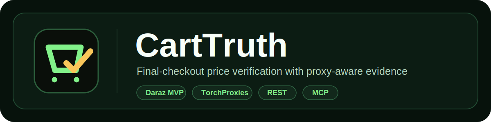
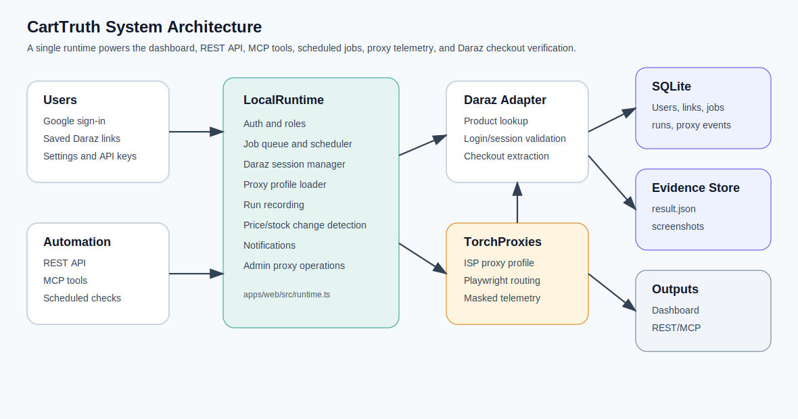
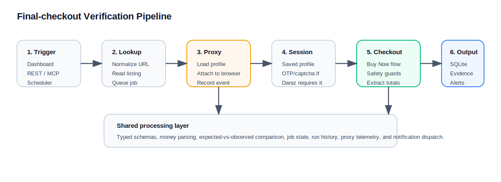
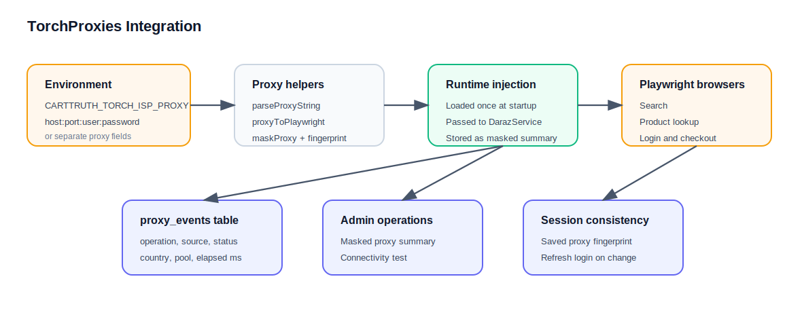

<p align="center">
  
</p>

# CartTruth: Final-checkout price verification for online shopping

CartTruth is a TypeScript web app and automation service that verifies whether an e-commerce product's displayed price still matches the final checkout total before purchase. The current MVP focuses on Daraz.lk: users save Daraz product links, connect their own Daraz session, and CartTruth runs a guarded Buy Now checkout flow that stops before any order, payment, or confirmation action. The app records the final observed total, evidence artifacts, run history, scheduled jobs, API/MCP access, notifications, and proxy telemetry.

CartTruth was built for shoppers, marketplace researchers, and travel/package buyers who need the real payable price instead of only the listing-page price. The difference from a normal scraper is that CartTruth checks the browser checkout surface with user-owned sessions, proxy-aware routing, safety guards, evidence capture, and a repeatable job pipeline.

Production app:

```text
https://carttruth.knurdz.org
```



## Overview

CartTruth answers one practical question: "What will this item really cost at checkout right now?" Modern marketplaces can change final totals based on delivery region, cookies, account state, stock, seller, checkout promotions, or anti-bot behavior. CartTruth keeps a saved product list per user, opens an isolated Daraz browser profile when login or verification is required, and then runs final-price checks that collect product-page and checkout evidence without completing the purchase.

The project currently supports Daraz.lk and is structured so additional retailers can be added through adapters. The same runtime powers the web dashboard, REST API, MCP tools, scheduled checks, and notification delivery.

## Key Features

| Feature | Description |
| --- | --- |
| Google sign-in and roles | Any verified Google account can sign in; admin access is restricted to emails in `CARTTRUTH_ADMIN_EMAILS`. |
| Daraz session capture | Each user gets an isolated Daraz browser profile for login, OTP, captcha, and verification. |
| Final-checkout verification | Runs a guarded Daraz Buy Now checkout flow and extracts product price, checkout total, delivery charges, and availability signals when Daraz exposes them. |
| Safety guardrails | Blocks order submission, payment, final confirmation, and payment-detail storage flows. |
| Evidence storage | Stores `result.json` and screenshots under the configured runs directory for auditability. |
| Scheduled checks | Users can enable automatic checks on an interval; the runtime queues and drains jobs with bounded concurrency. |
| REST API and MCP | User-created API keys can be scoped to REST, MCP, or both. |
| Notifications | Price/availability changes can trigger in-app notifications and Slack, Discord, or Telegram delivery. |
| TorchProxies integration | Routes Daraz browser activity through a configured TorchProxies-style proxy profile and records masked proxy telemetry. |
| Admin operations | Admins can inspect users, proxy summaries, recent proxy events, and run proxy connectivity tests without seeing raw secrets. |

## How It Works



1. **Input / trigger**: A user saves a Daraz product link, clicks manual check, enables scheduled checks, or calls the REST/MCP API.
2. **Product lookup**: `LocalRuntime` calls the Daraz adapter to normalize the product URL and read listing-page price/availability.
3. **Session preparation**: If checkout requires authentication, CartTruth uses the user's saved Daraz browser profile or opens the built-in browser for manual login/OTP/captcha.
4. **TorchProxies routing**: Daraz search, product lookup, inbuilt login browser, and checkout browsers receive the configured proxy profile through Playwright.
5. **Checkout check**: The Daraz adapter opens the product, uses guarded Buy Now navigation, reads checkout rows/totals, and refuses unsafe final-purchase actions.
6. **Processing layer**: Prices are parsed into typed money values, listing and checkout totals are compared, product changes are detected, and job status is updated.
7. **Output**: Results are written to SQLite and evidence files, displayed in the dashboard, exposed through REST/MCP, and delivered through notification channels.

## Pipeline Details

### Runtime pipeline

`apps/web/src/runtime.ts` is the application orchestrator. It owns the SQLite store, evidence directory, proxy profile, Daraz session manager, scheduler, job queue, notifications, API/MCP-facing methods, and proxy telemetry.

The main price-check path is:

```text
save link / queue job / API / MCP
  -> LocalRuntime.enqueueSavedLinkCheck or checkSavedLinks
  -> ensureDarazSessionForUser
  -> DarazService.check
  -> evidenceStore.writeJson + screenshots
  -> store.recordRun + updateSavedLinksFromResult
  -> in-app/webhook notifications when price or stock changes
```

### Adapter pipeline

Retailer-specific browser behavior lives in `packages/adapters`. The Daraz adapter performs search, product URL normalization, product-page extraction, session validation, cart/checkout navigation, Buy Now handling, checkout total extraction, and session metadata updates. Shared contracts live in `packages/schemas`, and shared runner/evidence/proxy/safety utilities live in `packages/core`.

### Job pipeline

Manual and scheduled checks are stored as `price_check_jobs`. On boot, the runtime requeues jobs that were left running, starts a scheduler, and drains queued jobs up to `CARTTRUTH_PRICE_CHECK_CONCURRENCY` with per-user Daraz locks so one user's browser profile is not used by competing checks.

### Automation pipeline

REST endpoints under `/api/v1` and the `/mcp` endpoint both call the same runtime methods as the dashboard. API keys are hashed in storage, scoped by capability, and rate limited separately for general REST, task-creating REST calls, and MCP.

## Proxy Integration



TorchProxies sits in the network layer between CartTruth's Playwright browsers and Daraz. CartTruth currently loads a TorchProxies-style ISP proxy from environment, converts it into Playwright proxy settings, attaches it to Daraz browser contexts, masks the credential-bearing endpoint everywhere it is shown, and records local telemetry for each proxied operation.

Why proxies are needed:

- Daraz checkout behavior can vary by IP region, account session, cookies, and traffic reputation.
- Repeated automated checks without proxy-aware routing can trigger blocks, empty responses, login challenges, or CAPTCHA/verification pages.
- Proxy continuity matters: the Daraz login browser and checkout browser should use the same proxy fingerprint so the saved account session remains valid.

How TorchProxies is used today:

- `CARTTRUTH_TORCH_ISP_PROXY=host:port:username:password` loads the default profile id `torch-isp-trial`.
- `packages/core/src/proxy.ts` parses the proxy string, masks secrets, creates Undici proxy URLs for connectivity tests, and creates Playwright proxy config.
- `apps/web/src/runtime.ts` loads the proxy once at startup and passes it into `DarazService`.
- `packages/adapters/src/daraz.ts` passes the proxy into Chromium for search, product lookup, inbuilt login/session capture, and persistent checkout browsers.
- Session metadata stores a masked proxy summary/fingerprint; if the current proxy changes, CartTruth asks the user to refresh the Daraz login session.
- `proxy_events` records operation, source, status, elapsed time, country, pool type, API-key context, and masked proxy metadata.
- Admin proxy routes expose summarized local telemetry and a proxy connectivity test.

What breaks without it:

- Checks may run from the server/VPS IP instead of the shopper-like network path the organizer expects.
- Saved Daraz sessions can become invalid if login and checkout happen through different network identities.
- Repeated product and checkout reads are more likely to encounter blocks, verification pages, or incomplete checkout data.

Current MVP limits:

- The user-side country selector saves `proxyCountryPreference`, but live routing still uses the configured environment proxy profile.
- Sticky session, rotate-before-next-check, and fallback-country controls are preview UI until routing support is expanded.
- `TORCHPROXIES_API_KEY` is reserved for future dashboard/API synchronization and is not used by current runtime code.

## Tech Stack

| Layer | Technology |
| --- | --- |
| Language | TypeScript, Node.js |
| Web server | Express |
| Frontend | React 19, Vite |
| Browser automation | Playwright Chromium |
| Data validation | Zod |
| Database | SQLite through Node `DatabaseSync` |
| API automation | REST API and Model Context Protocol SDK |
| Proxy | TorchProxies-style HTTP/HTTPS/SOCKS profile via Playwright and Undici |
| Notifications | Slack, Discord, Telegram webhooks/bot APIs |
| Tests | Vitest |
| Deployment | Docker Compose, Caddy HTTPS reverse proxy |

## Data Sources

| Source | Data Extracted | Method |
| --- | --- | --- |
| Daraz product pages | Title, URL, product id signals, listing price, availability | Playwright browser extraction through the Daraz adapter |
| Daraz checkout pages | Selected product rows, checkout total, delivery/adjustment line items, login/block states | Guarded Playwright checkout flow through the user's saved Daraz session |
| Google OAuth | User identity, verified email, display metadata | Google OAuth callback verification |
| User input | Saved links, settings, Daraz credentials, notification channels, API key scopes | Dashboard, REST API, MCP |
| TorchProxies config | Proxy endpoint, country, source, pool type, masked fingerprint | Environment variables parsed by `packages/core/src/proxy.ts` |
| Local telemetry | Runs, jobs, evidence paths, proxy events, notification delivery status | SQLite and filesystem evidence store |

## Quick Start

### Prerequisites

- Node.js 22+ or a compatible Node runtime
- pnpm 9.x
- Playwright browser dependencies
- Google OAuth Web application client
- TorchProxies ISP proxy credentials
- Docker and Docker Compose for VPS deployment

### Installation

```bash
git clone https://github.com/knurdz/cart-truth.git
cd cart-truth
pnpm install
```

### Configuration

```bash
cp .env.example .env
```

Fill the required values:

| Variable | Required | Description |
| --- | --- | --- |
| `CARTTRUTH_PUBLIC_URL` | Yes | Public base URL, for example `https://carttruth.knurdz.org`. |
| `CARTTRUTH_GOOGLE_CLIENT_ID` | Yes | Google OAuth Web client id. |
| `CARTTRUTH_GOOGLE_CLIENT_SECRET` | Yes | Google OAuth Web client secret. |
| `CARTTRUTH_GOOGLE_REDIRECT_URI` | Yes | OAuth callback URL, for example `/api/auth/google/callback`. |
| `CARTTRUTH_ADMIN_EMAILS` | Yes | Comma-separated Google emails that should become admins. |
| `CARTTRUTH_ENCRYPTION_KEY` | Yes | Server-only key used to encrypt saved Daraz credentials and notification config. |
| `CARTTRUTH_TORCH_ISP_PROXY` | Yes for proxied checks | TorchProxies profile in `host:port:username:password` or proxy URL format. |
| `CARTTRUTH_SQLITE_PATH` | Production | SQLite database path. Docker uses `/data/carttruth.db`. |
| `CARTTRUTH_SESSIONS_DIR` | Production | Browser session profile directory. Docker uses `/data/sessions`. |
| `CARTTRUTH_RUNS_DIR` | Production | Evidence output directory. Docker uses `/data/runs`. |
| `CARTTRUTH_BROWSER_MODE` | Recommended | Use `vnc` on VPS so users can complete Daraz login/OTP/captcha. |
| `CARTTRUTH_DARAZ_CHECK_HEADLESS` | Recommended | Use `true` for server-side automated checks. |

Common production values:

```bash
CARTTRUTH_DOMAIN=carttruth.knurdz.org
CARTTRUTH_PUBLIC_URL=https://carttruth.knurdz.org
CARTTRUTH_LOG_LEVEL=debug
CARTTRUTH_BROWSER_MODE=vnc
CARTTRUTH_DARAZ_CHECK_HEADLESS=true
CARTTRUTH_BROWSER_IDLE_TIMEOUT_MS=900000
CARTTRUTH_SQLITE_PATH=/data/carttruth.db
CARTTRUTH_SESSIONS_DIR=/data/sessions
CARTTRUTH_RUNS_DIR=/data/runs
CARTTRUTH_GOOGLE_CLIENT_ID=your-google-client-id
CARTTRUTH_GOOGLE_CLIENT_SECRET=your-google-client-secret
CARTTRUTH_GOOGLE_REDIRECT_URI=https://carttruth.knurdz.org/api/auth/google/callback
CARTTRUTH_ADMIN_EMAILS=your-admin@gmail.com
CARTTRUTH_ENCRYPTION_KEY=replace-with-openssl-rand-base64-32
CARTTRUTH_TORCH_ISP_PROXY=host:61234:username:password
```

Generate an encryption key:

```bash
openssl rand -base64 32
```

TorchProxies can be configured in one preferred string:

```bash
CARTTRUTH_TORCH_ISP_PROXY=host:61234:username:password
```

or separate fields:

```bash
CARTTRUTH_PROXY_HOST=host
CARTTRUTH_PROXY_PORT=61234
CARTTRUTH_PROXY_USERNAME=username
CARTTRUTH_PROXY_PASSWORD=password
CARTTRUTH_PROXY_PROTOCOL=http
CARTTRUTH_PROXY_COUNTRY=US
```

### Run

```bash
pnpm web
```

Open the printed local URL, usually:

```text
http://localhost:5173
```

API-only mode:

```bash
pnpm api
```

### One-command Docker Demo

```bash
docker compose up --build
```

For production, set real `.env` values first and point DNS at the host running Caddy.

## Project Structure

```text
cart-truth/
|-- apps/
|   |-- web/                 # React dashboard, Express API, MCP handler, runtime, SQLite store
|   `-- cli/                 # CLI entrypoint
|-- packages/
|   |-- core/                # Runner, evidence store, proxy helpers, money parsing, safety helpers
|   |-- adapters/            # Daraz adapter and retailer adapter registry
|   |-- schemas/             # Shared Zod schemas and TypeScript types
|   `-- notifications/       # Slack, Discord, Telegram notification delivery
|-- docs/                    # README diagrams and extra docs
|-- examples/                # Example Daraz product input
|-- tests/                   # Vitest coverage for API, proxy, Daraz flow, safety, schema, deploy
|-- scripts/                 # Install/update helpers
|-- docker-compose.yml       # App + Caddy deployment
|-- Dockerfile               # Production image
|-- Caddyfile                # HTTPS reverse proxy
|-- .env.example             # Environment template with placeholder values
`-- README.md
```

## Development Guide

### Running Locally

```bash
pnpm install
pnpm web
```

Useful local paths:

```text
.carttruth/sessions    Local browser profiles
runs                   Local run evidence
.env                   Local secrets, not committed
```

### Running Tests

```bash
pnpm test
```

Run a specific test file:

```bash
pnpm vitest run tests/proxy.test.ts
pnpm vitest run tests/daraz-flow.test.ts
```

### Common Dev Commands

```bash
pnpm typecheck
pnpm test
pnpm verify
pnpm exec vite build apps/web
```

### REST API

Create an API key in the dashboard, then call:

```bash
export CARTTRUTH_API_KEY=ct_your_api_key

curl https://carttruth.knurdz.org/api/v1/links \
  -H "Authorization: Bearer $CARTTRUTH_API_KEY"
```

Important REST endpoints:

```text
GET    /api/v1/me
GET    /api/v1/settings
PATCH  /api/v1/settings
GET    /api/v1/links
POST   /api/v1/links
DELETE /api/v1/links/:linkId
POST   /api/v1/links/check-jobs
GET    /api/v1/price-check-jobs
GET    /api/v1/price-check-jobs/:jobId
GET    /api/v1/runs
GET    /api/v1/runs/:runId
GET    /api/v1/runs/:runId/artifacts/:file
```

Task-creating REST calls are rate limited per API key and return `429` with `Retry-After` and `x-ratelimit-*` headers when limited.

### MCP

MCP endpoint:

```text
https://carttruth.knurdz.org/mcp
```

Available MCP tools:

```text
carttruth_list_links
carttruth_add_link
carttruth_delete_link
carttruth_get_settings
carttruth_update_settings
carttruth_queue_check
carttruth_list_jobs
carttruth_get_job
carttruth_list_runs
carttruth_get_run
```

Codex config:

```toml
[mcp_servers.carttruth]
url = "https://carttruth.knurdz.org/mcp"
bearer_token_env_var = "CARTTRUTH_API_KEY"
```

## VPS Deployment

### DNS

Create an `A` record:

```text
carttruth.knurdz.org -> YOUR_VPS_PUBLIC_IP
```

Verify:

```bash
dig +short carttruth.knurdz.org
```

### Server Setup

```bash
ssh root@YOUR_VPS_PUBLIC_IP
apt update && apt upgrade -y
apt install -y git curl ca-certificates openssl
curl -fsSL https://get.docker.com | sh
systemctl enable --now docker
```

### Clone And Configure

```bash
git clone https://github.com/knurdz/cart-truth.git /opt/carttruth
cd /opt/carttruth
cp .env.example .env
nano .env
```

Set these at minimum:

```text
CARTTRUTH_GOOGLE_CLIENT_ID
CARTTRUTH_GOOGLE_CLIENT_SECRET
CARTTRUTH_GOOGLE_REDIRECT_URI
CARTTRUTH_ADMIN_EMAILS
CARTTRUTH_ENCRYPTION_KEY
CARTTRUTH_TORCH_ISP_PROXY
```

### Start

```bash
docker compose up -d --build
docker compose ps
docker compose logs -f carttruth
```

Caddy handles HTTPS for the configured domain.

### Verify Deployment

```bash
curl -I https://carttruth.knurdz.org
curl https://carttruth.knurdz.org/api/health
docker compose logs --tail=100 caddy
```

First setup:

- Open `https://carttruth.knurdz.org`.
- Sign in with a Google account listed in `CARTTRUTH_ADMIN_EMAILS`.
- Confirm the account appears as admin.
- Open Settings and confirm API keys, notification channels, and TorchProxies Network panels load.
- Open Admin and confirm Users and Proxy Operations panels load.
- Have each user open and save their Daraz browser session before relying on checks.

## Updating A Live Deployment

```bash
cd /opt/carttruth
git pull --ff-only
docker compose up -d --build
docker compose logs -f carttruth
```

or:

```bash
./scripts/update.sh
```

## Backup And Restore

Backup SQLite:

```bash
docker compose exec carttruth sh -lc 'sqlite3 /data/carttruth.db ".backup /data/carttruth-backup.db"'
docker cp carttruth-carttruth-1:/data/carttruth-backup.db ./carttruth-backup.db
```

Backup the full data volume:

```bash
docker run --rm \
  -v carttruth_carttruth-data:/data \
  -v "$PWD":/backup \
  alpine tar czf /backup/carttruth-data.tgz /data
```

Restore during maintenance:

```bash
docker compose down
docker run --rm \
  -v carttruth_carttruth-data:/data \
  -v "$PWD":/backup \
  alpine sh -lc 'cd / && tar xzf /backup/carttruth-data.tgz'
docker compose up -d
```

## Troubleshooting

| Problem | Likely Cause | Fix |
| --- | --- | --- |
| Google sign-in fails | OAuth redirect URI mismatch | Add the exact local or production `/api/auth/google/callback` URL in Google Cloud Console. |
| Daraz check says login required | No saved Daraz profile or profile invalidated | Open the built-in Daraz browser, complete login/OTP/captcha, and save session. |
| Daraz asks for verification after auto-login | Marketplace challenge or captcha | Finish verification in the remote browser, then save session and retry. |
| Proxy requests fail | Bad proxy credentials, wrong format, or provider outage | Check `CARTTRUTH_TORCH_ISP_PROXY`, run the admin proxy test, and rotate credentials if needed. |
| Saved Daraz session no longer works after proxy change | Login was saved with a different proxy fingerprint | Re-open the Daraz browser and save login using the current proxy profile. |
| Scheduled checks do not run | No saved links, disabled schedule, or scheduler interval not due | Check Settings, `price_check_jobs`, and application logs. |
| Docker build fails | Stale dependencies or build cache | Run `docker compose build --no-cache carttruth`, then `docker compose up -d`. |

Useful logs:

```bash
docker compose logs -f carttruth
docker compose logs -f caddy
```

Useful production checks:

```bash
docker compose exec carttruth sh -lc 'ls -lah /data /data/runs /data/sessions'
docker compose exec carttruth sh -lc 'sqlite3 /data/carttruth.db ".tables"'
docker compose exec carttruth sh -lc 'sqlite3 /data/carttruth.db "select email, role, disabled from users;"'
docker compose exec carttruth sh -lc 'sqlite3 /data/carttruth.db "select operation, source, status, proxy_country, created_at from proxy_events order by created_at desc limit 10;"'
```

## Security Notes

- Never commit `.env`, real proxy credentials, OAuth credentials, Daraz credentials, API tokens, cookies, or session directories.
- API key tokens are hashed before storage and only shown once at creation.
- Session tokens are hashed before storage.
- Daraz passwords and notification configs are encrypted with `CARTTRUTH_ENCRYPTION_KEY`.
- Proxy passwords are masked in health responses, logs, UI, telemetry, and README examples.
- Logs redact secrets, passwords, cookies, bearer tokens, authorization headers, and proxy credentials.
- Admin routes never expose raw proxy passwords, Daraz passwords, API key tokens, cookies, or session secrets.
- CartTruth is a verification tool. It must not submit orders, pay, confirm purchases, or save payment details.
